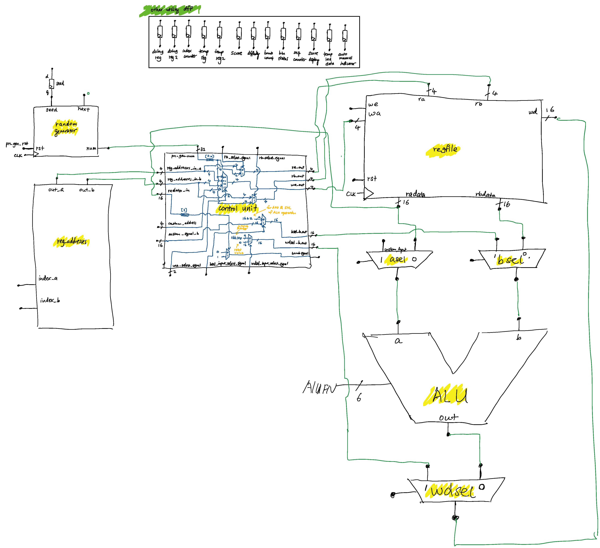

# bombsweeper
50.002 T1-2

## ALU Functions
* ADD: for adding the count of bombs surrounding one tile
* SHL: for locating the tile pressed and light up corresponding RGB LEDs
* SRA: for counting and displaying scores on the menu

## main FSM states
* MENU: Main menu displaying four options in four colors as well as current scores
* AUTO: auto assign bombs according to difficulty selected
* MANUAL: user manually place three bombs
* CHECK: check that all bombs have been placed
* READ: start reading all 16 tiles and add bomb_count accordingly
* READ0SEQ: The following 16 sequences define for each tile, who are the ones that need to add bomb count
* READ1SEQ
* READ2SEQ
* READ3SEQ
* READ4SEQ
* READ5SEQ
* READ6SEQ
* READ7SEQ
* READ8SEQ
* READ9SEQ
* READ10SEQ
* READ11SEQ
* READ12SEQ
* READ13SEQ
* READ14SEQ
* READ15SEQ
* WRITE: write bomb count to the corresponding tile register
* GAME: main game state for mining safe tiles
* WIN: all light up green to show player wins
* LOSS: all light up red to show player loses

## Game data path

